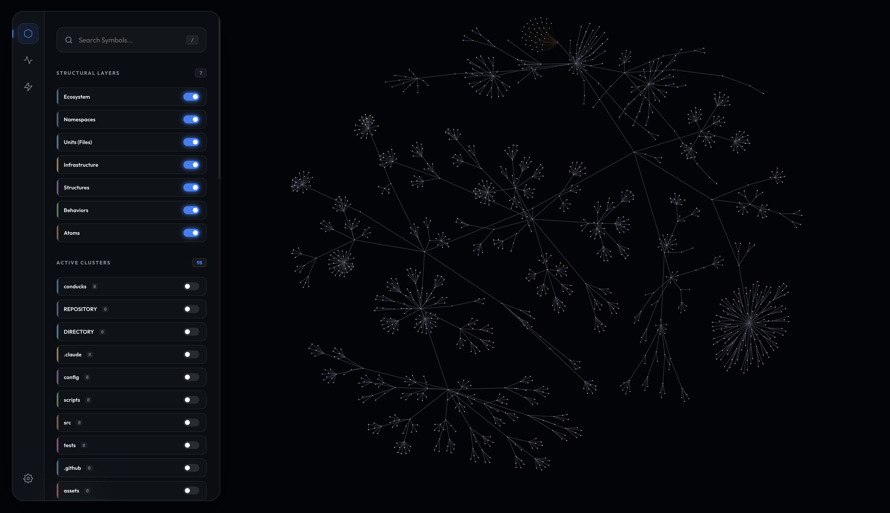

# 🏺 Conducks

> **Maps your entire codebase into a queryable graph. No embeddings, no guessing.**

Conducks parses your source code with Tree-sitter, extracts every symbol (functions, classes, routes, variables), and stores everything in a local DuckDB graph that stays in sync with your repo. Any AI agent or developer can then ask precise questions about your codebase and get exact, graph-verified answers.

---

## What problem does it solve?

AI coding assistants like Copilot or Claude typically use vector embeddings to find relevant code. That works fine most of the time, but it breaks down when you need precision: wrong file returned, symbol doesn't exist, circular dependency missed.

Conducks replaces that fuzzy search with a real static analysis graph built from your actual AST. Think of it as giving your AI agent a proper architectural map instead of a rough sketch.

```
Without Conducks:  "I think getUserById is somewhere in services..."
With Conducks:     getUserById at src/services/user.ts line 42, called by 7 places, risk score 0.31
```

---

## Who is it for?

| User | How they use it |
|---|---|
| **AI agents** (Claude, Antigravity, etc.) | Query symbols, trace call paths, detect regressions via MCP |
| **Developers** | Explore and understand unfamiliar codebases without reading every file |
| **Teams** | Enforce architectural rules before merging PRs |

---

## Getting started

### Prerequisites

- Node.js 18 or higher
- Git

### 1. Clone and build

```bash
git clone https://github.com/conducks/conducks
cd conducks
npm install && npm run build
npm link
```

After `npm link`, the `conducks` command is available globally. The built entry point is at `build/src/interfaces/cli/index.js` inside the repo folder — you'll need that path for the MCP config below.

### 2. Index your project

Go into the project you want to analyze and run:

```bash
cd /path/to/your/project
conducks setup
conducks analyze
```

This creates a `.conducks/` folder with the structural graph. From here you can use the CLI directly or connect it to an AI agent via MCP.

### 3a. Use the CLI

```bash
conducks query <name>     # Find a symbol by name
conducks explain <id>     # Risk breakdown for a symbol
conducks impact <id>      # What breaks if I change this?
conducks trace <id>       # Trace execution from a symbol
conducks audit            # Detect circular deps, god objects, orphans
conducks status           # Project health summary
conducks mirror           # Open the visual graph dashboard on port 3333
```



### 3b. Use it with an AI agent (MCP)

Add the following to your agent's MCP config. Replace `/absolute/path/to/conducks` with the path where you cloned the repo (run `pwd` inside the folder to get it).

**Claude Desktop** (`~/Library/Application Support/Claude/claude_desktop_config.json`):

```json
{
  "mcpServers": {
    "conducks": {
      "command": "node",
      "args": [
        "/absolute/path/to/conducks/build/src/interfaces/cli/index.js",
        "mcp"
      ],
      "env": {
        "CONDUCKS_FORCE_RELOAD": "true"
      },
      "disabled": false
    }
  }
}
```

**Antigravity** (`~/.gemini/antigravity/mcp_config.json`):

```json
{
  "mcpServers": {
    "conducks": {
      "command": "node",
      "args": [
        "/absolute/path/to/conducks/build/src/interfaces/cli/index.js",
        "mcp"
      ],
      "env": {
        "CONDUCKS_FORCE_RELOAD": "true"
      },
      "disabled": false
    }
  }
}
```

The agent will now have access to these tools:

| Tool | What it does |
|---|---|
| `conducks_query` | Find any symbol by name or pattern |
| `conducks_status` | Project health summary and entry points |
| `conducks_explain` | Risk breakdown for a specific symbol |
| `conducks_impact` | See what breaks if you change a symbol |
| `conducks_trace` | Trace execution between two symbols |
| `conducks_audit` | Detect circular deps, god objects, orphans |
| `conducks_diff` | Structural diff of uncommitted changes |
| `conducks_rename` | Graph-verified safe rename across the codebase |
| `conducks_guide` | Architectural guidance and standards |

---

## CLI reference

```bash
conducks setup                    # Initialize Conducks in a project
conducks analyze                  # Parse and index the codebase
conducks watch                    # Auto-reindex on file changes while you work
conducks query <name>             # Find a symbol by name
conducks list                     # List all indexed symbols
conducks status                   # Project health summary
conducks explain <id>             # Risk breakdown for a symbol
conducks impact <id>              # What breaks if I change this?
conducks trace <id>               # Trace execution from a symbol
conducks audit                    # Detect circular deps, god objects, orphans
conducks advise                   # Refactor suggestions based on the graph
conducks diff                     # Structural diff of uncommitted changes
conducks rename <id> <new-name>   # Graph-verified safe rename
conducks guard                    # Block commits if risk threshold exceeded
conducks blueprint                # Generate BLUEPRINT.md from the graph
conducks bootstrap-docs <name>    # Scaffold project documentation
conducks mirror                   # Open the visual graph dashboard
conducks mcp                      # Start the MCP server
```

---

## Supported languages


| Language | Support level |
|---|---|
| TypeScript / JavaScript | Full |
| Python | Full |
| Go | Full |
| Rust / C++ / C | High |
| Java / C# | High |
| PHP / Ruby / Swift | High |

---

## How it works

1. Conducks uses Tree-sitter to parse every file into an AST
2. Symbols get extracted and grouped into layers (files, namespaces, classes, functions, variables)
3. Import and call relationships are resolved to connect the graph
4. Everything is stored in a local DuckDB database inside `.conducks/`
5. The CLI, MCP server, and Mirror dashboard all read from the same graph
6. A file watcher keeps the graph updated as you work

All analysis runs locally. No data leaves your machine.

---

## Docs

- [ARCHITECTURE.md](./ARCHITECTURE.md) - Internal design and layer taxonomy
- [CHANGELOG.md](./CHANGELOG.md) - Release history
- [CONTRIBUTING.md](./CONTRIBUTING.md) - How to contribute

---

*v0.8.0 | Apache 2.0 | [conducks.com](https://conducks.com)*
