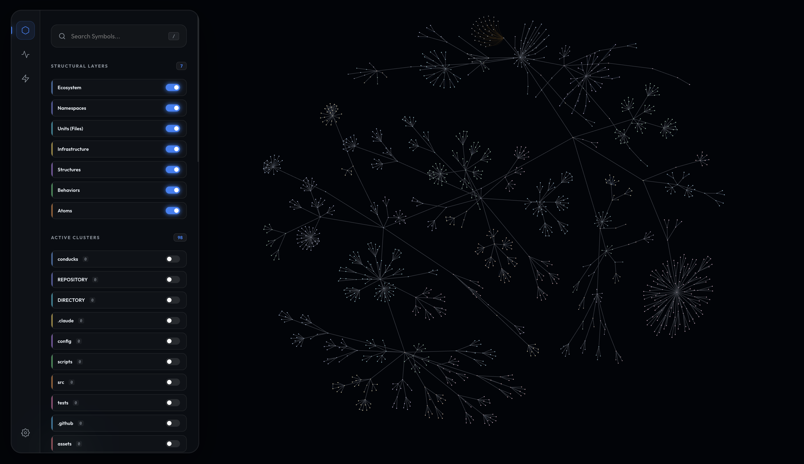

<!-- @format -->

# 🏺 Conducks

> **A structural map of your codebase, built from the AST. No embeddings, no guessing.**

Conducks parses your source code with native **Tree-sitter** bindings and extracts every symbol from the **Ecosystem** layer down to the **Atom** layer. It stores the result in a local DuckDB structural vault that stays in sync with your repo. Any AI agent or developer can then ask precise questions about your codebase and get exact, graph-verified answers.

---

## What problem does it solve?

AI coding assistants typically use vector embeddings to find relevant code. That works fine for general snippets, but it breaks down when you need **architectural fidelity**: wrong file returned, symbol doesn't exist, or deep call-chains are missed.

Conducks replaces that fuzzy search with a deterministic structural graph built from your actual AST. Think of it as giving your AI agent a high-resolution map of your system instead of a rough sketch.

```
Without Conducks:  "I think getUserById is somewhere in services..."
With Conducks:     getUserById at src/services/user.ts line 42, called by 7 places, risk score 0.31
```

---

## Who is it for?

| User                                      | How they use it                                                        |
| ----------------------------------------- | ---------------------------------------------------------------------- |
| **AI agents** (Claude, Antigravity, etc.) | Query symbols, trace call paths, detect regressions via MCP            |
| **Developers**                            | Explore and understand unfamiliar codebases without reading every file |
| **Teams**                                 | Enforce architectural rules before merging PRs                         |

---

## Getting started

### Prerequisites

- Node.js 20 or higher (LTS 20/22 recommended). Node 23+ works but needs `npm run bootstrap` — see the [native build note](#native-build-note-node-23).
- A C/C++ toolchain for the native `tree-sitter` build (Xcode Command Line Tools on macOS, `build-essential` on Linux)
- Git. Conducks discovers files via `git ls-files`; outside a Git repo it falls back to a filesystem scan that only picks up `.py .js .ts .java .kt .go .rb .json .txt .md .env` and `Dockerfile`.

### 1. Clone and build

```bash
git clone https://github.com/conducks/conducks
cd conducks
npm run bootstrap && npm run build
npm link
```

`npm run bootstrap` installs dependencies and, on Node 23+, forces the C++20 flag the native
`tree-sitter` build needs (see the [native build note](#native-build-note-node-23)). On Node LTS
20/22, plain `npm install --legacy-peer-deps` works too.

After `npm link`, the `conducks` command is available globally. The built entry point is at `build/src/interfaces/cli/index.js` inside the repo folder — you'll need that path for the MCP config below.

### 2. Index your project

Go into the project you want to analyze and run:

```bash
conducks setup      # installs the conducks skills into .claude/skills/ and writes .conducksignore
conducks analyze    # parses the codebase and builds the graph in .conducks/
```

`analyze` is what creates the structural vault (`.conducks/conducks-synapse.db`). From here you can
use the CLI directly or connect it to an AI agent via MCP.

> `conducks setup` also tries to auto-register Conducks in Claude Desktop, but it writes
> `<current-dir>/build/index.js` — a path that does not exist. Configure MCP by hand as shown below.

### 3a. Use the CLI

```bash
conducks query <name>     # Find a symbol by name
conducks explain <id>     # Risk breakdown for a symbol
conducks impact <id>      # What breaks if I change this?
conducks trace <id>       # Trace structural dependencies from a symbol
conducks audit            # Detect circular deps, god objects, orphans
conducks status           # Project health summary
conducks mirror           # Open the visual graph dashboard on port 3333
```



### 3b. Use it with an AI agent (MCP)

Add the following to your agent's MCP config. Replace `/absolute/path/to/conducks` with the path where you cloned the repo (run `pwd` inside the folder to get it).

**Claude Desktop** (`~/Library/Application Support/Claude/claude_desktop_config.json`):

```json
{
	"mcpServers": {
		"conducks": {
			"command": "node",
			"args": [
				"/absolute/path/to/conducks/build/src/interfaces/cli/index.js",
				"mcp"
			],
			"disabled": false
		}
	}
}
```

**Antigravity** (`~/.gemini/antigravity/mcp_config.json`):

```json
{
	"mcpServers": {
		"conducks": {
			"command": "node",
			"args": [
				"/absolute/path/to/conducks/build/src/interfaces/cli/index.js",
				"mcp"
			],
			"disabled": false
		}
	}
}
```

The server reads the workspace root from `--root <path>`, else from the `CONDUCKS_WORKSPACE_ROOT`
environment variable, else from the current working directory. The default transport is stdio; pass
`mcp --sse` if your client needs an SSE transport instead (served on port 3001).

The agent will then have access to these 14 tools:

| Tool                   | What it does                                                                                 |
| ---------------------- | -------------------------------------------------------------------------------------------- |
| `conducks_query`       | Find any symbol by name or pattern (fuzzy and template modes)                                 |
| `conducks_status`      | Project health summary, hotspots, and entry points                                             |
| `conducks_explain`     | 6-signal risk breakdown for a symbol (gravity, complexity, entropy, churn, fan-out, fallback)  |
| `conducks_impact`      | See what breaks if you change a symbol (blast radius)                                          |
| `conducks_trace`       | Trace execution or data flow between symbols                                                   |
| `conducks_audit`       | Detect circular deps, god objects, violations (modes: scan, advice, guard, archeology, fallback) |
| `conducks_context`     | Collect structural context around a symbol within a graph radius                              |
| `conducks_flows`       | List execution flows — each a named entry point and the symbols it calls                      |
| `conducks_prune`       | Find dead code: orphaned symbols, unused exports, stale imports                                |
| `conducks_coverage`    | Overlay an istanbul/c8 `coverage-final.json` onto the graph — per-function fill %              |
| `conducks_docs`        | Progress board parsed from the authored docs: todo %, ADR states, grammar violations           |
| `conducks_diff`        | Structural diff of uncommitted changes                                                         |
| `conducks_rename`      | Graph-verified safe rename across the codebase                                                 |
| `conducks_graph_query` | Run a raw SELECT against the DuckDB graph store                                                |

Usage guidance for agents does **not** ship as an MCP tool. It ships as eight skills that
`conducks setup` copies into `.claude/skills/` — `conducks-guide`, `conducks-cli`,
`conducks-exploring`, `conducks-impact-analysis`, `conducks-refactoring`, `conducks-debugging`,
`conducks-governance`, `conducks-docs`.

---

## CLI reference

**Lifecycle**

```bash
conducks setup                    # Configure MCP and install skills
conducks analyze [--staged] [--verbose] [--force]
                                  # Index and analyze repository structure
conducks watch                    # Start real-time monitoring of structural shifts
conducks doctor                   # Check environment health for Conducks
conducks clean                    # Nuclear purge: evict blocked handles and purge the vault
conducks uninstall                # Remove the MCP config + skills that setup installed
conducks mcp [--sse] [--root <path>]
                                  # Launch the MCP server
conducks mirror                   # Start the visual explorer (port 3333; --live to auto-refresh)
conducks help                     # Show the built-in help (note: `conducks --help` is not recognized)
```

**Explore**

```bash
conducks query <pattern> [--mode fuzzy|template] [--template <id>] [--limit <n>] [--json]
conducks status [--mode pulse] [--file <path>] [--blueprint] [--json] [path]
conducks explain <symbol_id>      # Risk signal decomposition for a symbol
conducks context <symbolId> [--json]
                                  # Symbol relationships and technical flows
conducks trace <symbol_id> [--flow]
                                  # Structural dependencies (--flow for data lineage)
conducks impact <symbolId> [upstream|downstream] [--json] [--tree]
                                  # Blast radius analysis
conducks flows                    # List behavioral processes across the graph
conducks entry [path]             # List detected entry points (API, CLI, Main)
conducks cohesion <id1> <id2>     # Structural similarity between two symbols
conducks entropy <symbolId>       # Structural risk of a symbol
```

**Govern**

```bash
conducks audit [--fallback] [--history=<window>]
                                  # Structural integrity and governance audit
conducks guard [--threshold=N] [--force]
                                  # Enforce stability thresholds (note: --threshold=N, not --threshold N)
conducks advise                   # Architectural recommendations
conducks diff [--base <id>] [--head <id>]
                                  # Structural risk of the current changes
conducks drift [prevPulseId]      # Architectural drift between two pulses
conducks prune                    # Unused exports and dead code
conducks fallback [--min-confidence 0.7] [--min-tenure 365] [--limit 20]
                                  # Legacy fallback-pattern analysis
conducks supply-chain [--deps-only]
                                  # Dependency / boundary surface (stdlib vs versioned deps)
conducks ledger                   # Workspace survey + grade
conducks rename <symbolId> <newName> [--confirm]
                                  # Safe rename — dry-run unless --confirm
```

**Coverage and docs**

```bash
conducks coverage <coverage-final.json> [--json] [--all] [--save-baseline] [--vs-baseline] [path]
                                  # Overlay istanbul/c8 coverage onto the graph
conducks coverage-view <coverage-final.json> [--out coverage.html] [--watch] [path]
                                  # Render the overlay as a static HTML file
conducks bootstrap-docs [project_name]
                                  # Scaffold the conducks-docs file set into docs/
conducks docs-lint [path]         # Validate authored docs against the grammar (CI gate)
conducks docs-status [--json] [path]
                                  # Progress board parsed from the docs
conducks record --type [vision|architecture|implementation|handover|conventions|todo|memory] "content"
                                  # Record a learning, decision, or intent
```

**Federation**

```bash
conducks list                     # List all federated projects
conducks link <path>              # Link a foundation synapse
conducks resonance <path>         # Compare structure to another project
```

---

## Supported languages

Every language below is parsed with a native Tree-sitter grammar and a per-language query file.
"Verified" means a real `analyze` run on sample sources produced the listed nodes.

| Language                | Support level | Verified behavior                                                                   |
| ----------------------- | ------------- | ----------------------------------------------------------------------------------- |
| TypeScript / TSX        | Full          | symbols, imports + per-binding imports, calls, type-usage edges, React hook nodes   |
| JavaScript / JSX        | Full          | symbols, ES + CommonJS `require` imports, calls                                     |
| Python                  | Full          | symbols, imports + named bindings, calls                                            |
| Go                      | Full          | functions, structs, interfaces, methods, generics, type-usage edges                 |
| Rust                    | Partial       | functions, structs, traits, enums, impl methods — no per-binding imports, no type-usage edges |
| C / C++                 | Partial       | structs/classes, functions, methods — no per-binding imports, no type-usage edges   |
| C#                      | Partial       | namespaces, classes, methods — properties are not extracted                         |
| Ruby                    | Partial       | classes and methods                                                                 |
| Java                    | Partial       | classes, records, interfaces, enums, methods, fields, imports, **EXTENDS/IMPLEMENTS heritage**; no constructors (name-collision with the class), no annotations, no type-usage edges |
| PHP                     | Partial       | namespaces, classes, traits, interfaces, enums, methods, functions, typed properties, use-imports incl. aliases; no heritage edges, no constants or enum cases |
| Swift                   | Partial       | classes, actors, structs, enums, extensions, protocols, funcs/init/deinit, properties, enum cases, typealiases, **conformance + superclass heritage**; no subscripts, no property wrappers, no async/visibility DNA |

Two limits apply to every language:

- **Inheritance edges exist only for Java and Swift** (since 2026-07-25 — their heritage patterns
  co-capture the subject, which `reflector.ts:438` requires). TypeScript, TSX and Go still persist
  zero `EXTENDS`/`IMPLEMENTS`: their heritage patterns capture `@heritage` alone, so the reflector
  drops the match. The Java fix is the recipe (todo11).
- **Type-usage edges only for TypeScript, TSX and Go.** Other languages have no type-position
  capture, so type-only-import detection never fires for them.

**How the fallback works.** If a native grammar fails to load, a parse crashes, or a query fails to
compile, Conducks does not error out — it degrades that file to the **Gnosis** path, which emits a
single file-level node and no symbols. Counts drop silently, so a language that looks "supported" can
be contributing nothing. Run with `CONDUCKS_DEBUG=1` to see the fallback messages.

### Native build note (Node 23+)

Conducks parses with **native** `tree-sitter` Node bindings (runtime `tree-sitter@0.25`). On newer
Node releases (23/24/25) the V8 headers require C++20, but tree-sitter's `binding.gyp` defaults to
C++17 — a plain `npm install` then fails with `"C++20 or later required."`.
**`npm run bootstrap` handles this automatically** (it sets `CXXFLAGS=-std=c++20` on Node ≥ 23, then
installs). To do it manually:

```bash
CXXFLAGS="-std=c++20" npm install --legacy-peer-deps   # do NOT also set CFLAGS — it breaks the C compile
```

Node LTS 20/22 build without the flag. The grammar's language-ABI must match the runtime.

---

## The 9-layer canonical taxonomy

Conducks normalizes every language's own node kinds (`semantic_kind`) into one canonical set
(`canonicalKind`), ordered from the broadest container to the narrowest symbol:

| Kind           | What it holds                                          |
| -------------- | ------------------------------------------------------ |
| **ECOSYSTEM**  | Cross-repo dependencies and third-party packages       |
| **REPOSITORY** | The current project or microservice boundary           |
| **PACKAGE**    | A deployable/versioned unit inside a workspace         |
| **DIRECTORY**  | Filesystem folders                                     |
| **UNIT**       | Individual source files                                |
| **INFRA**      | Architectural hubs (routers, controllers, decorators)  |
| **STRUCTURE**  | Classes, interfaces, structs, enums, types             |
| **BEHAVIOR**   | Functions, methods, constructors                       |
| **ATOM**       | Variables, properties, constants, fields               |

The enum in `taxonomy.ts` declares 13 kinds — it also lists `NAMESPACE`, `STATEMENT`, `BRANCH` and
`DATA` — but the vault is pruned at the end of every `analyze`: `DATA` is deleted outright, and an
`ATOM` survives only if it carries a real reference edge. So the persisted graph has the 9 kinds
above. **BEHAVIOR is the deepest routinely-emitted node**; parameters and local variables live as
attributes on their parent, not as graph nodes.

---

## How it works

1. **Discovery**: files are listed from Git (`git ls-files`, submodules included), filtered by `.conducksignore`.
2. **Structural pulse**: each file is parsed with its native Tree-sitter grammar and query file; anything that fails to parse degrades to the Gnosis file-level fallback.
3. **Taxonomic extraction**: symbols are normalized from the language's own kinds into the canonical taxonomy.
4. **Linking**: import, call, construct and type-reference relationships are resolved into a global graph.
5. **Vault**: nodes and edges are written to a local DuckDB database inside `.conducks/`, then the taxonomy prune runs.
6. **Read surfaces**: the CLI, the MCP server, and the Mirror dashboard all provide read-only access to that graph.

All analysis runs locally. No data leaves your machine.

---

## Docs

- [docs/README.md](./docs/README.md) - Map of the project documentation (state, read order, what each doc holds)
- [CHANGELOG.md](./CHANGELOG.md) - Release history
- [CONTRIBUTING.md](./CONTRIBUTING.md) - How to contribute

---

_v0.7.7 | Apache 2.0 |_
