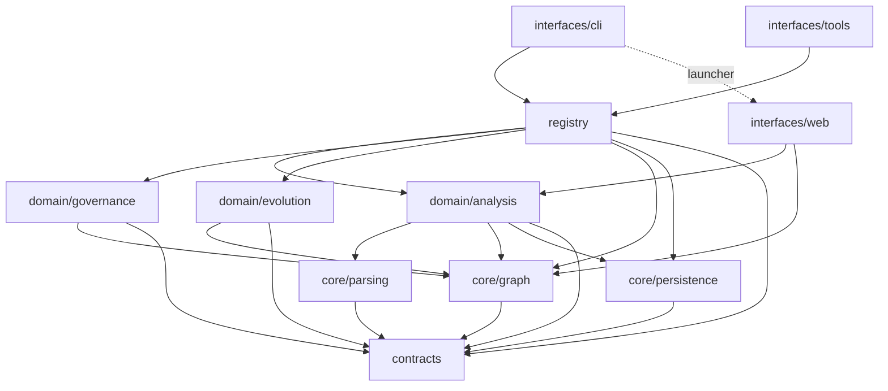

# Architecture — conducks

| node | note |
|---|---|
| `contracts` | |
| `core/parsing` | [visuals/modules/core/parsing.md](./visuals/modules/core/parsing.md) |
| `core/graph` | [visuals/modules/core/graph.md](./visuals/modules/core/graph.md) |
| `core/persistence` | [visuals/modules/core/persistence.md](./visuals/modules/core/persistence.md) |
| `domain/analysis` | [visuals/modules/domain/analysis.md](./visuals/modules/domain/analysis.md) |
| `domain/governance` | [visuals/modules/domain/governance.md](./visuals/modules/domain/governance.md) |
| `domain/evolution` | [visuals/modules/domain/evolution.md](./visuals/modules/domain/evolution.md) |
| `registry` | [visuals/modules/registry.md](./visuals/modules/registry.md) |
| `interfaces/cli` | [visuals/modules/interfaces/cli.md](./visuals/modules/interfaces/cli.md) |
| `interfaces/tools` | [visuals/modules/interfaces/tools.md](./visuals/modules/interfaces/tools.md) |
| `interfaces/web` | |

## Contract
1. Dependencies run downward only: contracts ← core ← domain ← composition (registry) ← interfaces (cli, mcp, web).
2. `contracts` imports nothing.
3. `core` imports contracts only.
4. `domain` imports core + contracts.
5. `registry` is the only composition point; it imports domain + core + contracts.
6. Interfaces never import each other, with two encoded exceptions: `cli → web` (the `mirror` command launches the web server — a launcher edge, not logic coupling) and `web → domain`/`core` directly.
7. The structural graph is not materialised by `registry.initialize()`. A path that walks it calls `ensureGraphLoaded()` first; a path that can answer from the vault does that instead (CONDUCKS-30, ADR 0038).
- Enforced by: tests/architecture/boundaries.test.ts (reads both import forms and fails on any upward import), and .github/workflows/main.yml (the `Enforce Layer Contract` step, `conducks guard` on the graph `analyze` just wrote)

`tests/architecture/boundaries.test.ts` is the gate that runs on every suite. It walks the source
tree and fails on a runtime import that crosses a layer upward, reading BOTH import forms — a
statement and a dynamic `import()` — because a rule that reads only one is a rule the next bypass
walks straight through. `import type` is exempt: the compiler erases it (ADR 0016). It carries one
named exception, `pulse-worker.ts -> reflector`, which is stated in the test rather than left as a
silent hole.

`conducks guard` evaluates the `layer_boundaries` sentinel rule on this repo's real graph and
hard-blocks any upward edge — imports and calls alike. CI is the only place it runs: the pre-commit
hook cannot afford a full re-analysis, and guard reading a stale graph would gate yesterday's code.

`tests/unit/domain/governance/layer-contract.test.ts` pins the RULE, not this repo — it audits a
synthetic graph against the default ruleset and uses a nonexistent root to stay isolated. It cannot
see a live violation, and for most of this project's life it was cited here as though it could,
while three real violations stood (CONDUCKS-13: a check that evaluates to nothing reports success).

Test files are outside the contract. A unit test imports the unit it tests, so
`tests/unit/interfaces/tools/filter-builder.test.ts` classifies as `mcp` by path while testing a
`domain` module. Routing those through the registry would turn every unit test into an integration
test — a worse codebase bought with a greener gate.

The test guards the rule STAYING ON, not just the table being right. That is the failure that
happened: the contract existed as ADR 0005 plus a disabled rule for months while ~71 illegal edges
accumulated, true on paper and false in the graph (CONDUCKS-22). It also runs a synthetic `core →
domain` edge through the real evaluator, so the rule silently no-opping fails the suite too.
