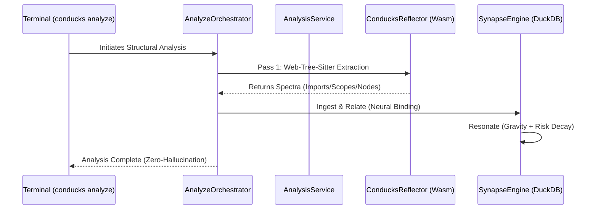

# CONDUCKS — Master Structural Manifest 💎

Conducks is a **Git-native, deterministic structural intelligence platform**. Unlike traditional LLM search (RAG) which relies on probabilistic patterns, Conducks uses **Graph Theory** and **Wasm-powered Parsing** to build a deterministic **Structural Map** of your codebase.

---

## 🏛️ 1. The 10-Tool "Unified" Taxonomy

To reduce agentic drift and maximize structural precision, Conducks organizes its intelligence into **10 specialized domains**.

| Domain | Professional Entry Point | Description | Status |
|---|---|---|---|
| **1. Analysis** | `conducks analyze` | High-fidelity structural indexing. | ✅ Pulse |
| **2. Discovery** | `conducks query` | Fuzzy and Regex symbol identification. | ✅ Granular |
| **3. Landscape** | `conducks status` | Hotspots, Pillars, and Entry Points. | ✅ Manifest |
| **4. Behavioral** | `conducks impact` | Bidirectional Blast Radius Analysis. | ✅ Bidirectional |
| **5. Kinetic Path**| `conducks trace` | Dijkstra Execution Tracing (v1.7.0). | ✅ Deterministic |
| **6. Analytical** | `conducks explain` | 6-Signal Technical Risk & Bus Factor. | ✅ 6-Signal |
| **7. Governance** | `conducks audit` | Sentinel Integrity & Circular Audits. | ✅ Sentinel |
| **8. Historical** | `conducks diff` | Structural drift across code versions. | ✅ Chronoscopic |
| **9. Mutational** | `conducks rename` | GVR: Graph-Verified Refactoring. | ✅ Atomic |
| **10. Visual** | `conducks mirror` | Real-time architectural graph visuals. | ✅ Mirror |

---

## 🧬 2. Topological Connectivity (Wasm-Powered)

The structural synapse reaches **Total Trace Visibility** using a unique parallel topological sorting pipeline.

---

## 🚀 3. Professional Usage Guide

### 🔍 Discovery & Mapping
> [!TIP]
> Use `status` early to identify high-risk areas before deep-diving into individual files.
- `conducks query q="NeuralBinding"`: Find the binding logic.
- `conducks status hotspots`: List the top 10 structural pillars.
- `conducks status entry-points`: List all entry origins (REST, CLI, Mains).

### ⚡ Behavioral Tracing
- `conducks impact symbol="id"`: Calculate blast radius.
- `conducks trace --target="id"`: Shortest weighted structural bridge.
- `conducks trace flow`: Full downstream execution circuit.

### 🛡️ Governance & Integrity
- `conducks audit`: Run the Sentinel integrity check.
- `conducks explain symbolId`: Get professional risk decomposition.
- `conducks status health`: Check staleness and graph health.

---

## ⚖️ 4. The Conducks Advantage (Deterministic vs Heuristic)

| Objective | Standard Coding AI | **CONDUCKS** |
|---|---|---|
| **Relationship Logic**| Probabilistic (Guessing) | **Mathematical Proof (SCC)** |
| **Symbol Resolution** | Filename Matching | **Unique Hash Binding (Synapse ID)**|
| **Code Modification** | Find & Replace (Dangerous) | **Graph-Verified (Safe)** |
| **System Visibility** | File-level context | **Total Structural Context (Graph)**|

---

> [!IMPORTANT]
> **Rule 10/13 Policy**: This manifest represents the authoritative 10-tool state. Any tool count variance in the MCP server is considered a structural violation.
