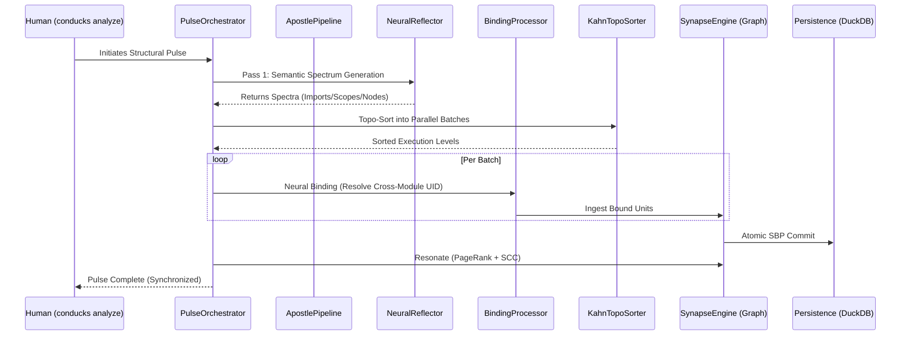

# CONDUCKS — Apostle v6: Master Manifest 💎

## 📖 Introduction
Conducks is a **Git-native, deterministic structural intelligence platform**. It differs from traditional Search RAG by using formal mathematics (Graph Theory, Information Theory) to build a high-fidelity "Synapse" of your codebase.

---

## 🏗️ Architectural Cleanliness Audit
> [!CAUTION]
> **Fragmentation Audit**: My research confirms that while the system is functional, it suffers from **high module fragmentation**. A single domain (e.g., Analysis) is currently spread across **5 separate folder hierarchies** (`core`, `product/indexing`, `product/indexing/processors`, `product/indexing/languages`, `mcp`).

### Fragmentation Heatmap
| Domain | Folder Sprawl (Module Jump Count) | Cleanliness Score | Status |
|---|---|---|---|
| **Analysis** | `core`, `indexing`, `processors`, `python`, `mcp` (**5**) | ⚠️ LOW | Fragmented |
| **Evolution** | `core/refactor`, `core/graph`, `core/watcher`, `analysis`, `mcp` (**5**) | ⚠️ LOW | Fragmented |
| **Metrics** | `core/algorithms`, `core/graph`, `analysis`, `mcp` (**4**) | 🟠 MEDIUM | Decoupled |
| **Governance**| `core/policy`, `analysis`, `mcp` (**3**) | ✅ HIGH | Cohesive |
| **Intelligence**| `indexing`, `mcp` (**2**) | ✅ HIGH | Cohesive |

---

## 🧬 1. The Apostle Pipeline (Orchestration)
Engines do not work in isolation. They form a **Topological Pulse Pipeline**:

---

## 💎 2. The 8 Unified Apostle Domains (58 Engines)

| Domain | Apostle Engines (The Core) | Terminal (Human) | Apostle Tool (Agentic Mode) |
|---|---|---|---|
| **1. Analysis** | `PulseOrchestrator`, `ApostlePipeline`, `NeuralReflector`, `SynapseRegistry`, `KahnTopoSorter`, `WasmProvider`, `RefractionEngine`, `SpectrumGenerator`, `SynapseEngine`, `ImportMap` | `conducks analyze` | `conducks_analyze` (graph_pulse) |
| **2. Intelligence**| `ConducksSearch`, `GQLParser`, `NameIndex`, `SearchEngine`, `GraphSearcher`, `PrismReflection` | `conducks query` | `conducks_query` (graph_query, expert_gql) |
| **3. Governance**  | `ConducksSentinel`, `ApostleAdvisor`, `AuditEngine`, `PolicyRegistry`, `StatusEngine`, `AnomalyDetector`, `ApostleStalenessSensor` | `conducks verify`, `advise`, `status` | `conducks_governance` (graph_audit, advisor) |
| **4. Kinetic Trace**| `CerebralFlowEngine`, `TraceAnalyzer`, `AstarPathFinder`, `FlowProcessor`, `CallProcessor`, `HeritageProcessor` | `conducks trace`, `flows` | `conducks_trace` (kinetic_trace, expert_path) |
| **5. Evolution**   | `GVREngine`, `DiffEngine`, `DeadCodeAnalyzer`, `ImpactAnalyzer`, `ConducksWatcher`, `GitChronicle`, `CoChangeMatrix` | `conducks rename`, `diff`, `prune`, `watch` | `conducks_evolution` (kinetic_refactor, graph_diff) |
| **6. Metrics**     | `ShannonEntropy`, `CohesionVector`, `PageRankGravity`, `CompositeRiskEngine`, `TestAligner`, `ResonanceAnalyzer`, `TarjanSCC`, `GraphStats` | `conducks entropy`, `explain` | `conducks_metrics` (graph_entropy, decomposition) |
| **7. System Mgmt** | `ApostolInstaller`, `MCPConfigurator`, `MirrorServer`, `BlueprintGenerator`, `ToolRegistry`, `HyperToonRegistry` | `conducks setup`, `mirror` | `conducks_system` (system_install, mirror) |
| **8. Multi-Workspace**| `FederatedLinker`, `SynapseLinker`, `ChronicleInterface`, `DuckDBPersistence`, `PulseContext` | `conducks link` | `conducks_link` (expert_link) |

---

## 🛠️ 3. Agentic Strategy (The "Selective Fidelity" Pattern)
As an agent, I prefer **Domain-Grouped Tools** (the 8 Unified tools) over having 58 individual tool calls.

- **Why?**: If I have 58 tools, I spend too many tokens choosing which one to call. 
- **Selective Fidelity**: By calling `conducks_metrics`, I get an expert response that aggregates *Risk*, *Gravity*, and *Complexity* in a single context window, rather than making 3 separate calls.
- **Naming Alignment**: The names in the user's snippet (e.g. `graph_pulse`, `expert_gql`) are mapped as **Modes** within these 8 tools to keep the schema clean and the intent clear.

---

## ⚖️ 4. Conducks (Deterministic) vs GitNexus (Heuristic)

| Feature | GitNexus | CONDUCKS | Value |
|---|---|---|---|
| **Core Search** | Hybrid (BM25 + Semantic) | **Deterministic Graph Math (GQL)** | Zero "Halucination" in relationships |
| **Logic** | LLM-assisted exploration | **Mathematical Integrity** (Tarjan/SCC) | Guarantees cyclic proof |
| **Safe Rename** | Heuristic Text Search | **GVR (Graph-Verified Rename)** | 100% confidence, zero breakage |
| **Metrics** | Cohesion Scores | **6-Signal Advanced Risk** | Decomposes informativeness/debt |
| **Governance**| Informational only | **Sentinel Enforcement (Lawful)** | Block unapproved architectural drift |
| **Diffing** | File-level context | **Chronoscopic Pulse Delta** | Structural risk travel across time |
