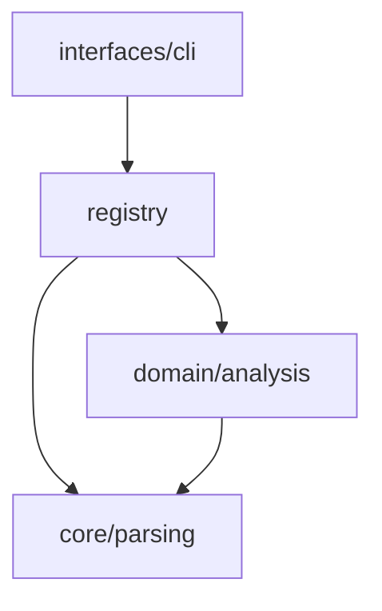

<!-- description: The documentation standard for every project, single repo or monorepo. Docs hold AUTHORED intent only: features, an architecture graph, per-module notes, conventions, memory, decisions, todos, handover. How code is WIRED (calls, imports, cycles, dead code, coverage) is never written to a file; query it from the conducks graph. Covers which files exist at repo root versus inside each service, per-tree ADR and todo numbering and how addresses cross trees, the exact line grammar the parser reads, and what docs-lint fails on. Use when creating, moving, or reviewing any doc, bootstrapping docs/, writing an ADR or todo, or deciding where a fact goes. -->

# conducks-docs

**Author intent. Query wiring.** A doc holds what code cannot say: why a thing exists, what was
decided, what bites you, what a module is for. Wiring is queried, never written — it is wrong by the
next commit.

| question | ask |
|---|---|
| cycles, dead code | `conducks audit`, `conducks prune` |
| what breaks if X changes | `conducks impact X` |
| X's dependency chain | `conducks trace X` |
| test fill per function | `conducks coverage` |
| entry points, hotspots | `conducks status --mode map` |

Sections and subsections are numbered so anything can cite one rule: `conducks-docs §6.8`. **Add at
the end of a section; never renumber** — a citation that silently points at the wrong rule is worse
than no citation, and it has happened. (The `###` numbering here is prose structure in this standard.
Inside a governed doc `###` still opens nothing — §5.1.)

---

## §1 The bar

Write for a reader holding only the repo. **A fact that lives only in a conversation does not exist.**

A doc passes when that reader can:

1. say what the thing is and why it exists
2. see the decision **and the option rejected**
3. tell current state from intended where they differ — say so: "code does X, we meant Y"
4. do the next thing, with a `file:line` anchor

Naming a service is not an anchor. `packages/product/finance/FinanceService.ts:132` is.

Write it the turn you decide it: a choice → ADR, a trap → `memory.md`, work → a todo.

---

## §2 Where a fact goes

**Q1 — can conducks compute it?** Yes → query it. No → write it.

**Q2 — when it becomes wrong, do you fix it or write a new one?**

| | living — overwrite in place | record — frozen |
|---|---|---|
| | `features` `architecture` `modules/` `conventions` `memory` `handover` | `decisions/` `todos/` |

A record's only permitted mutation is a **stamp**: a status line, or a pointer to where truth moved.
Changing its reasoning or outcome is forbidden.

**Q3 — who owns it?** Can you name one service that must change if this line becomes false?

| case | goes to |
|---|---|
| one service must change | that service's tree |
| two services touched | the one that must change if it is wrong — not everyone who reads it |
| no owner | root — this is what root is for |
| schema or column semantics | `database/docs/` |
| adding or removing a service | create/delete its tree **and** its root index entry, same change |

**Apply ownership one fact at a time, never a whole file.** A file is not owned; each line in it is.

**`memory` vs `conventions`:** a rule you must FOLLOW → `conventions.md`. A surprise you must KNOW →
`memory.md`. Once a rule prevents a trap, delete the memory entry — a resolved gotcha is a deleted
gotcha, not one labelled "resolved".

---

## §3 Layout

**Which shape.** Split only at 2+ services. One service → one flat `docs/` at the repo root, and no
root tree above it. A `packages/` folder is not the test; ownership is (see Monorepo below). Adding
the second service is what creates the root tree.

### §3.1 Single repo

```
docs/
├── features.md       what each capability is for, and why       living
├── architecture.md   the module graph + the contract its arrows obey  living
├── conventions.md    binding rules, IDed, with reasons          living
├── memory.md         traps the code cannot show                 living
├── modules/          one note per module                        living
├── decisions/        one ADR per numbered file                  record
├── todos/            todoNN.md + completed/                     record
├── handover.md       snapshot for the next session              living, dated
└── <soft>/           product/ business/ design/ — prose, not grammar-linted
                       (`product/` holds SPECS, which outrank the code — §8)
```

### §3.2 Monorepo

A **service** is a part with its own owner: `app`, `admin`, `database`, `packages/core`,
`packages/product`. The test is **ownership, not whether it boots** — `database` never runs, but when
a schema fact is wrong, `database` is what changes.

```
docs/                    ROOT — what no single service owns
├── features.md          index only; links down, states no facts of its own
├── architecture.md      the service graph + the contract between services
├── conventions.md       rules the whole codebase follows      ROOT ONLY
├── memory.md            traps that span services              ROOT ONLY
├── handover.md                                                ROOT ONLY
├── decisions/           ADRs for seams
├── todos/               epics for codependent work only
└── <soft>/              product/ business/ design/ — ROOT ONLY, never inside a service

app/docs/                SERVICE — same for admin, database, packages/*
├── features.md          what this service does
├── architecture.md      this service's module graph + its layer contract
├── modules/             MODULE.md notes
├── decisions/           this service's own ADRs
└── todos/               this service's work + completed/
```

**Root vs service — no file appears in both columns except by design:**

| file | root | service | if both exist |
|---|---|---|---|
| `features.md` | index only, no facts | the facts | root links down; a fact is in exactly one |
| `architecture.md` | the service graph | that service's module graph | same shape, one altitude apart |
| `modules/` | — | yes | root has no modules; it owns no code |
| `decisions/` | seam ADRs | that service's ADRs | numbered per tree; cross-tree refs are `app:0014` (§4) |
| `todos/` | codependent epics only | that service's work | epic points down, slice points up |
| `conventions.md` | yes | **never** | — |
| `memory.md` | yes | **never** | — |
| `handover.md` | yes | **never** | — |

Root-only for `conventions` / `memory` / `handover`: constraints load once per session, and split
across services an agent cannot know it has them all.

**No `README.md`.** Root is never the general version of a service doc — a capability in exactly one
service still gets its root link.

**Links run one way.** Root links down. Todo slices link up to their epic. Nothing sideways.

### §3.3 Bootstrapping a new tree

Create the FULL folder set, with real files, at the moment the tree is created — do not wait for facts
to arrive. An empty `docs/` gives the next reader nothing to find and nowhere to put what they learn.

| create now, even if thin | create when first needed |
|---|---|
| `features.md`, `architecture.md`, `handover.md` (root only) | `modules/<path>/MODULE.md` — one per module that earns a note |
| `decisions/`, `todos/` (folders) | `conventions.md`, `memory.md` (root only) — once there is a rule or a trap |

`conducks bootstrap-docs [name]` writes the root set; `--service` writes the service set. A file with
one placeholder entry is correct; a file that does not exist is not. Never create `progress.md`,
`map.md` or `drift.md` (§8).

**Declare the services.** `conducks.json` at the repo root — `{ "services": ["app", "packages/core"] }`
— is what makes a service a service. Without it conducks guesses from "does this folder hold a
`docs/`?", which cannot tell an owner from a folder that happens to hold documentation, and misses a
service whose docs are not written yet — exactly when the reminder matters most.

---

## §4 Numbering and addresses

**Numbers are per tree.** Each tree counts its own: next = highest **in that tree** + 1. `app` and
`admin` may both hold a `todo123`, and they are different records — a record belongs to the tree it
sits in, and a service extracted tomorrow keeps its own numbering intact.

**An address carries its tree when it crosses one.**

```
todo123#P2          inside the same tree — the tree is implied
app:todo123#P2      from another tree, or from root
app:0014            an ADR in the app tree
(root):todo41       an epic at root, referenced from a service
```

Unqualified inside its own tree, `tree:` prefixed everywhere else. A bare `todo123` written from a
different tree points at nothing and cannot be resolved — `docs-lint` fails it.

The tree label is the service path as `conducks` prints it: `app`, `admin`, `packages/core`, and
`(root)` for the repository root.

**Filenames.** ADRs are `NNNN-kebab-title.md`, zero-padded to 4 (`0014-native-grammars-optional.md`).
Todos are `todoNN.md`, zero-padded to 2 (`todo09.md`), growing a digit past 99. The slug is the title
lowercased, non-alphanumerics collapsed to `-`, trimmed to roughly six words.

**Never rename a record.** The number and slug are how everything cites it. A wrong title is
superseded, not relabelled.

---

## §5 The line grammar

Five per-line primitives, no frontmatter:

```
# Title                 one per file, first line
Status: <value>         life state, one line, directly under the title
## Section              a heading
- [ ] task              one of four states — see below
- Key: value            a field
```

### §5.1 Exact syntax the parser requires

Measured against the regexes, not inferred:

| primitive | must be | tolerated | silently NOT read |
|---|---|---|---|
| `# Title` | `#` + at least one space, first line | — | `#Title` (no space) |
| `Status: value` | **column 0**, no leading whitespace | `Status:value` (no space after colon) | any indented `Status:` |
| `## Section` | exactly two `#` + a space | — | `###` (never a section — see below) |
| `- [ ] task` | `-`, brackets, one of `space` `x` `X` `>` `-` | `-[x]`, `[X]`, any indentation | any other marker — it FAILS lint, it is not ignored |
| `- Key: value` | **key starts with A–Z** | `-Key:v`, indented, multi-word (`Blocked by`) | `- builds:` — lowercase key parses as NOTHING |

A key may hold letters, digits, spaces, `.`, `/`, `-`. It must START uppercase: `- builds: 0027` is
prose, not a field, and nothing warns you.

**`Status:` has one vocabulary per file type, and a value outside it FAILS lint.** Three types carry
one; the rest have no `Status:` at all.

| file | vocabulary |
|---|---|
| `todos/todoNN.md` | `todo` · `doing` · `done` · `blocked` |
| `decisions/NNNN-*.md` | `Accepted` · `Superseded by NNNN` — an amendment is an `- Amended by:` field, never a status |
| `handover.md` | `current` · `stale` |
| everything else | no `Status:` line |

Content inside ``` or ~~~ fences is skipped entirely — examples in a fenced block never parse as real
tasks or fields.

| rule | detail |
|---|---|
| **A value is the whole line** | No continuation exists. The wrapped part is not merged into the value — it is lost, and lint FAILS the file for it. Need a paragraph? Use a `##` section. Prose wraps freely. |
| **Blank line after the last task/field** | An UNINDENTED prose line directly under `- [ ]` or `- Key:` is the wrap above: not merged, and lint fails. Indented continuation lines, and lines starting `#` `>` `\|` `-` `1.` `![` `<`, pass lint — but they are still not part of the value, so nothing that must be READ may live there. A multi-line bullet is fine for prose; a flush-left paragraph is not. |
| **Indenting a checkbox does NOT nest it** | The parser accepts any leading whitespace, so an indented `- [ ]` is a full sibling task under the same phase. Indent for readability if you like; you get no hierarchy from it, and its checkbox counts in the phase total exactly like every other. Real grouping inside a long phase is a `###` heading. |
| **One key per file** | A repeated key: the last silently wins. Earlier ones are not merged, not warned. Multiple values go on one line, comma-separated. |
| **ADR ref fields read the LEADING refs only** | On `- Amended by:`, `- Supersedes:`, `- Builds:` and the other ADR relation keys, the parser takes the four-digit refs at the START of the value and stops at the first non-ref. Trailing prose is allowed and ignored: `- Amended by: 0012, 0018 — both on checkout` is valid. A note attaching to ONE ref still goes in the paragraph below; there is no per-ref slot on the line. |
| **`- Depends:` is the exception — it scans the WHOLE line** | Every `todoNN#PN` anywhere in the value is read as a real dependency, including inside trailing prose. So `- Depends: todo09#P3 (todo10#P1 landed first)` silently declares TWO dependencies. Put no phase address in a `- Depends:` note. |
| **Read headings match exactly** | `## Context — the measured problem` is not `## Context`; it counts as missing. Put qualifiers in the first sentence. |
| **Phase numbers are plain integers** | `## Phase 2b` matches no phase — not an error, *invisible*. Its tasks never reach `docs-status`, and `todoNN#P2b` addresses nothing. Split → next free integer + `(was Phase 2b)` in the title. |
| **`###` is not a section** | Only `## ` opens one. Tasks under a `###` count toward the enclosing `## Phase N`. This is how a long phase groups work without a nested phase. |
| **Every phase carries ≥1 checkbox** | The checkbox is the only carrier of task state. A phase without one reports `0/0 (no open task)` — which reads as "nothing to do" whether it is finished, not started, or prose. Lint fails it. |

```markdown
WRONG                                          RIGHT
- [x] moved service to packages/product        - [x] moved service to packages/product
Both apps typecheck.                           
                                               Both apps typecheck.

- Amended by: 0012 (checkout)                  - Amended by: 0012, 0018
- Amended by: 0018 (pricing)                   
  first line dropped; 0012 reads unstamped     per-ref notes go in the prose below

## Phase 1 — remove the import `[DONE]`        ## Phase 1 — remove the import
Shipped via the hook. Gate green.              - [x] setAuthInitializer hook added
                                               - [x] KNOWN allowlist emptied, gate green
```

**State is derived, never announced.** A `[DONE]` marker is a second copy of what the checkboxes
already hold, and its prose is unaddressable. Date and narrative go in the paragraph under the tasks.

### §5.2 The checkbox carries the state, and there are exactly four

A task's state lives in its marker and nowhere else. There is no `## Deferred` section, no `[~]`, no
ALL-CAPS note doing the job instead.

| marker | means | counted in the denominator | needs a reason |
|---|---|---|---|
| `- [ ]` | open — owed, nobody has done it | yes | no |
| `- [x]` | done — and provable | yes | no |
| `- [>]` | deferred — still owed, not now | **yes** | **yes** |
| `- [-]` | dropped — not coming back | **no** | **yes** |

**Deferred stays in the denominator; dropped leaves entirely.** That difference is the whole point.
`[>]` keeps the work visible as unpaid, so a todo cannot reach 100% by parking what is hard. `[-]` is
a decision not to carry something, and it stops being owed — which is exactly why it costs a reason.

**A `[>]` or `[-]` with no reason FAILS lint.** Write the reason as an em-dash clause **on the task's
own line**:

```markdown
- [>] Publish the package — deferred to a human, not an agent: publishing spends a name once
- [-] Second cache tier — dropped: the measured hit rate never justified a second tier
```

**The reason must be on the same line as the marker.** An indented continuation line is legal
markdown and renders fine, but the parser reads a task's text as its own line only — so a reason
pushed onto the next line is invisible and the task fails lint as reasonless. This is the most common
way the check surprises someone.

**A parked task with no stated reason is a deleted one nobody can find.** Six months later there is
no way to tell a hard problem someone chose to postpone from one that was quietly abandoned, and the
board reports the same number for both.

**`[>]` is not a defect.** An unanswered question in Phase 0 is not deferred work — leave it `[ ]`.
Reach for `[>]` when the work is real, understood, and blocked on something named.

### §5.3 What is not read

**An unrecognised line is prose.** Never encode state in: emoji or `[DONE]` in a heading ·
strikethrough · bold or ALL-CAPS DONE · HTML comments · indentation, which carries no meaning · a
`Status:` not directly under the title · any field key not listed in this standard. A fact is read
only as a `Status:`, a `- Key: value`, or a `- [ ]`. **There is no fourth way.**

### §5.4 What docs-lint fails on

**Only six types are linted:** `todos` · `decisions` · `features` · `conventions` · `memory` ·
`handover`. `architecture.md`, `MODULE.md` and the soft folders are parsed but NOT grammar-checked —
a broken heading there fails nothing, so the structures above are conventions you keep, not gates.

**`docs-lint` FAILS the gate on:** a missing `# Title` · a missing `Status:` on a todo, decision or
handover · a `Status:` outside its file's vocabulary · a wrapped value · a todo with no `## Phase N`
section · a todo with no `- Acceptance:` · two phases sharing a number · a phase with no tasks · a
missing or misspelled `## Context` / `## Decision` / `## Consequences` · a `- Builds:` or `- Depends:`
pointing at an ADR or phase that does not exist · a relation stamped on one end only · superseding a
record that still has open phases without `- Inherits:` · a cross-tree address naming a tree that
does not exist, or a record that does not exist in it · an unknown checkbox marker · a `[>]` or `[-]`
with no stated reason · **a `- Depends:` that crosses a tree** — it fails even when the address
resolves, because the order it claims is not one this tree can keep · **`conventions.md`,
`memory.md` or `handover.md` inside a service tree** — they are root-only, and split across services
an agent reading one tree cannot know it is missing the rest · **any `README.md` under a docs tree**,
outside `completed/` `legacy/` `archive/` `agent-runs/`. It cannot see `## Phase 2b` — that is a
silent gap in `docs-status`.

### §5.5 What it warns on

**Hygiene — true findings that break no grammar:** `Status: done` still
sitting in `todos/` · `Status: done` with unchecked tasks · `Status: doing` with everything checked ·
`Status: blocked` with neither an unmet `- Depends:` nor a `- Blocked by:` · **every task deferred and
none complete** — a deferral is not a completion · **`Status: done` with deferred tasks still in it**,
because `completed/` is not scanned and closing the file buries them · **a `progress.md`, `map.md` or
`drift.md`** — derived files, never read and never linted; ask `conducks docs-status` and move them to
`legacy/` · ADRs with no build link
and no `- Enforced by:`, reported as one aggregated list rather than one line each. A warning is the
gap between your claim and the checkboxes — fix it in the same turn or it becomes noise you learn to
ignore.

---

## §6 Each file

### §6.1 `features.md`

```markdown
# Features — <service>

## <Capability> — `<command or entry point that runs it>`
- Purpose: what it is for, in one line the code cannot say
- Intent: why it exists, or the tradeoff taken

## Tunables
| knob | default | file:line | effect |
```

Name the entry point in the heading. Add `## Tunables` once the service has defaults, thresholds or
gates. Update when an ADR and its todos finish. **Root `features.md` is an index only.**

### §6.2 `architecture.md` — the graph, and the rules its arrows obey

Nothing else. A diagram, the node-to-module links, the contract, the enforcing test.

````markdown
# Architecture — <service>



| node | note |
|---|---|
| `interfaces/cli` | [modules/interfaces/cli/MODULE.md](./modules/interfaces/cli/MODULE.md) |
| `core/parsing` | [modules/core/parsing/MODULE.md](./modules/core/parsing/MODULE.md) |

## Contract
1. Nothing under `core/` imports from `interfaces/`.
2. `registry` is the only composition point.
- Enforced by: tests/unit/core/scope-guard.test.ts
````

A node links to its MODULE.md **if it has one**. Notes are written only where intent is not obvious
(see `modules/`), so a node with no note leaves the link cell empty — that is normal, not a gap. A
contract states its enforcing test.

**Root level** — the same shape one altitude up: services as nodes, the contracts between them, what
crosses each boundary, the direction data flows. It owns no service's internals.

Mermaid, so it stays text.

**Authored, never generated.** This is the real shape one level above the code. Conducks cannot
produce it — naming the parts is judgement. Everything below it (calls, imports, cycles, dead code)
stays queried.

**Where each fact goes:**

| the fact is about | goes to |
|---|---|
| the shape, or which arrows are legal | `architecture.md` |
| exactly one module | that module's `MODULE.md` |
| a trap, a name collision, a deleted module | `memory.md` |

*Layer* is the one word both files use. `architecture.md` holds the **contract** — which dependencies
are legal, whole tree. A MODULE.md `**Layer:**` says **where that one module sits in it**. About to
repeat a rule in a MODULE.md? It belongs in `architecture.md`.

### §6.3 `modules/<path>/MODULE.md`

**Mirror the source tree** — layout under `modules/` matches source layout, nested as deep. Finding a
note is a path translation, not a search.

| form | for |
|---|---|
| `modules/<path>/MODULE.md` | a folder-shaped module or part |
| `modules/<path>/<name>.MODULE.md` | a single file whose intent needs its own note |

**Write a note when intent stops being obvious from the code, never to complete a set.** Size does not
enter into it. A part earns its own note when its intent differs from its parent's; the parent then
becomes a link-only overview.

```markdown
# <module> — <one line: what it is>

**Layer:** where this module sits in the contract — the node it is in `architecture.md`
**Responsibility:** what it owns; what it explicitly does not
**Boundaries:** the seams — what crosses in and out, and the rule at each
**Deferred / not built:** designed, chosen not to build, and why

## Sub-modules            only when parts have their own notes
- [part](./part/MODULE.md) — one line each

## Traps                  optional
- the thing that looks wrong and is not, or looks fine and bites
```

Prose after those fields carries rejected alternatives, correctness notes, the incident that produced
a rule. No symbol maps or call lists — ask `conducks trace` / `conducks impact`.

Feature = what the system offers. Module = what one part owns, refuses, assumes, breaks on.

### §6.4 `conventions.md` — root only

```markdown
# Conventions — <repo>

## <PREFIX>-1 — <short title>
- Rule: the binding rule, stated as an instruction
- Reason: what went wrong without it
```

State the cost in `Reason:` — a rule without one gets dropped as inconvenient.

**A rule that binds only one service still lives here.** Name the scope in the rule itself
(`- Rule: in packages/core, ...`). `conventions.md` is root-only, and `architecture.md` holds the graph
and its contract — nothing else — so there is no service-level rules file. Two exceptions, both
narrower than a rule:

| the rule is about | goes to |
|---|---|
| which dependencies are legal | that service's `architecture.md` `## Contract` |
| one module's own behaviour | that module's `MODULE.md` under `**Boundaries:**` |

### §6.5 `memory.md` — root only

```markdown
# Memory — <repo>

## <short title>
- Gotcha: what looks wrong, or the constraint
- Why: the reason the code cannot show
- Applies: file or area, and which service
```

Two kinds of entry belong here that look like architecture and are not:

- **Names that collide.** One word meaning several things in the codebase, one entry each. Usually the
  highest-value thing in the file.
- **Removed modules — do not re-add.** A deleted module has no MODULE.md left to hold the warning, so
  without an entry here the next reader re-creates it. Say what went and why.

### §6.6 `decisions/NNNN-title.md`

```markdown
# NNNN — <title>
Status: Accepted | Superseded by NNNN
- Amended by: NNNN, NNNN
- Enforced by: <the test or symbol that proves it is built>
- Date: <ISO>

<what each amendment changed, in prose>

## Context
## Decision
## Consequences
```

**One decision per numbered file.** Two calls in one record cannot be superseded separately — the
second dies with the first.

An ADR is **prose**, and must state **what was not chosen**. Checkboxes and requirement lists belong
in the todo that implements it.

`Status:` carries life state only and is the one line of an accepted ADR that may change. Only a
supersede kills a record. Every other link is a field **stamped on both ends**:

| this record | the other record |
|---|---|
| `- Amended by: NNNN, NNNN` | `- Amends: NNNN` |
| `- Superseded by: NNNN` | `- Supersedes: NNNN` |
| `- Resolved by: NNNN` | `- Resolves: NNNN` |

| relation | means |
|---|---|
| **amends** | part of the record changed. The amended ADR stays `Accepted` and stays binding — read both. |
| **supersedes** | the whole record is replaced. It is dead; do not act on it. |
| **resolves** | the record left a question open (a deferred call, an either/or); this one answers it. The original stays `Accepted` and stays correct. |

**Superseding a half-built record:** add `- Inherits: NNNN (the part never built)` so the remainder
keeps an owner. Lint requires it when the superseded record still has unfinished work.

### §6.7 `todos/todoNN.md`

```markdown
# todoNN — <title>
Status: todo | doing | done | blocked
- Acceptance: one line, testable
- Blocked by: external cause, when no phase explains it

## Phase 1 — <title>
- Builds: NNNN            the ADR this phase implements
- [ ] open task
- [x] done task

## Phase 2 — <title>
- Depends: todoNN#P1      the phase that must finish first — same tree only
- [ ] open task
```

**`- Depends:` never crosses trees.** It takes a bare `todoNN#PN` inside its own tree, never a
qualified `app:todoNN#PN`. Cross-service coupling goes through a root epic (§6.10) and nowhere else —
two paths to the same fact would disagree. Reason: an inline cross-tree dep is invisible from the
other tree, so one side ships without knowing.

**The phase is the unit of linkage.** One todo may serve several decisions or none; one ADR may be
built across phases in several todos. Keep a phase to one coherent chunk with one owner ADR or none —
serving two decisions means it is two phases. Phase numbers are unique in a file; `todoNN#PN` is an
address others point at.

**State is derived.** Checkbox = task state. Phase state = its checkboxes. Blocked = an unmet
`- Depends:` or a stated `- Blocked by:`. An ADR's build state = the phases claiming it plus
`- Enforced by:`. Percent done = checked ÷ total. `Status:` is your claim, and lint compares it
against the checkboxes. Find every slice of an epic with `conducks docs-status`, or
`grep -rln "todoNN" */docs/`.

**Never trust a done task without a test that could have failed.** A test with no assertions reads as
coverage and is worse than none.

### §6.8 What a task says: the PROBLEM and the PROOF, never the code

A task states what is wrong and how you will know it is fixed. It does not state which lines to
write. Whoever picks it up can read the code; what they cannot recover is why it is wrong and what
"done" means.

| write | do not write |
|---|---|
| the symptom, and where it bites | a diff, or a file to open and edit |
| the evidence it is real — a number, a `file:line`, a failing case | a guess dressed as a fact |
| what proves it fixed | "make it work" |
| the constraint that rules an approach out | the approach itself, when more than one would do |

```markdown
❌ In db-client.ts, wrap the setTimeout in a clearTimeout on line 591

✅ Every command that opens the database hangs ~5s after printing its answer.
   The close path races the close against a 5s timeout and never clears the
   losing timer, so the event loop stays alive. Measured: answer at 451ms,
   exit at 5.5s. Fixed when such a command exits in under a second.
```

The first is worthless six months later, when line 591 is something else. The second still reads
correctly, still says what to check, and leaves the fix to whoever is holding the code.

**State the evidence, not the hunch.** "The store seems bloated" is not a task. "The store holds
8.7 MB of rows in 235 MB, proven by rewriting it; the two documented reclaim commands were each
measured and neither shrinks the file" is one — and it stops the next person re-running the same
eliminations.

**A task an agent cannot verify is not done, it is claimed.** Every task should name what a reader
runs to check it. If nothing can be run, say so and say why, rather than leaving the reader to assume
a test exists.

**A todo may carry a `## Context` section.** `- Acceptance:` is one line and one line cannot describe
a large job — what it is for, what it rests on, what was ruled out. Put that in a `## Context`
directly under the fields, before Phase 1. It is prose, it is not a phase, and nothing counts it.
Write it whenever the phase titles alone would not tell a stranger what this todo is.

### §6.9 The unsolved problem is a task, and it lives in Phase 0

Not every task is work. Some are questions nobody has answered yet, and the answer changes what gets
built. Those go in a **Phase 0** that everything below `- Depends:` on:

```markdown
## Phase 0 — decide before building
- [ ] Measure the cost of X. If it is over Nms the design in Phase 2 does not hold
- [ ] Two agents on one project: reads FAIL during a write. No solution yet — record what breaks

## Phase 2 — build it
- Depends: todo20#P0
```

This is the note-keeping place. A problem with no solution is written as an open task, in its own
words, and REVISED IN PLACE when the answer arrives — a task's text is not frozen. Recording the
problem before the answer is the point: an unwritten problem is rediscovered, and rediscovering it
costs more than the note did.

**A Phase 0 task is not a defect.** Do not turn one into a `[-]` because it is unsolved. Drop it only
when the question stops mattering, and say why.

### §6.10 How to size, group and divide

The failure is a todo that describes a whole quarter and a todo that describes one afternoon, sitting
in the same folder addressed the same way.

| you have | make it |
|---|---|
| one decision, one chunk of work | one ADR, one todo, phases inside it |
| one decision, work that splits by concern | one ADR, one todo, ONE PHASE PER CONCERN |
| several decisions that only make sense together | several ADRs, ONE todo — a phase per ADR, each `- Builds:` its own |
| work depending on an unanswered question | Phase 0 for the question, `- Depends:` from the phases it gates |
| codependent work across services | a root epic (below) |

**There is no sub-ADR, and there must not be.** A decision that needs sub-decisions is several ADRs —
"one decision per file" is what lets each be superseded on its own. What GROUPS them is the todo: a
todo whose phases each `- Builds:` a different ADR is the epic for those decisions, and
`conducks docs-status` renders exactly that tree. Reach for a nested record and you have built a
second grouping mechanism beside the one that already works.

**Size a phase by what fails together.** If half of it can ship while the other half is still broken,
it is two phases. If a reviewer would have to read both halves to judge either, it is one.

**Order phases by what unblocks what, never by how the work feels.** The board reads top to bottom
and `- Depends:` is the only thing that makes an order real.

**Codependent work across services gets a root epic — nothing else does.** An app-only fix lives in
`app/docs/todos/`. The epic is how a cross-service dependency is expressed: it holds no work of its
own, just the slice order, one checkbox per slice addressed as `tree:todoNN`, and why they are coupled.
Each slice opens with a line pointing up at the epic (`(root):todo41`), so the link is stamped at both
ends and either end can be found from the other.

```markdown
# todo41 — payouts move behind one port
Status: doing
- Acceptance: app and admin both read payouts through the port; neither writes the table directly.

## Phase 1 — the two slices, in order
- [x] app:todo42
- [ ] admin:todo43

admin lands after app: the port has to exist before admin can point at it.
```

An ADR cannot hold this: it is frozen, and joint status moves.

**On close, in order:**

1. Promote surviving facts — rule to `conventions.md`, trap to `memory.md`, capability to `features.md`.
2. Give the ADR an `- Enforced by:` pointing at the test that now proves it. The `- Builds:` link leaves
   the graph with the file, so without this the ADR reports as unbuilt.
3. Set `Status: done`.
4. Move the file to `completed/`.

**`completed/` is not scanned** (nor `legacy/`, `archive/`, `agent-runs/`). Two consequences:

- A file there is **no longer linted**. Open tasks → leave it in `todos/` with `Status: doing`.
- Its `- Builds:` leaves the graph, so the ADR reports **no build link** unless it carries an
  `- Enforced by:`.

### §6.11 `handover.md` — root only

```markdown
# Handover — <ISO-date>
Status: current | stale

## Where it stands
## Next, in order
```

Overwrite at session end and re-stamp the date — never appended. Two sections, ≤15 lines. Untouched
this session? Set `Status: stale`.

### §6.12 No progress file

What shipped and when comes from dated ADRs and closed todos: `conducks docs-status`, or
`conducks_docs` with `recent: <n>`. An existing `progress.md` is derived — unread, unlinted — and
belongs in `legacy/`.

---

## §7 Reading and enforcing

**Every tree is read; trees stay separate.** `docs-lint`, `docs-status` and `conducks_docs` are
recursive: root plus every service. A single repo has one tree and behaves identically, so nothing has
to know which case it is in.

```
conducks docs-lint              root + every service; fails if any tree fails
conducks docs-lint --root-only  the root tree alone
conducks docs-lint app          one service
```

Trees are **never merged**: `todo123` in `app` and `todo123` in `admin` are different records, so a
merged board would collide two real todos under one address. `docs-status --json`
returns a map keyed by tree; `conducks_docs` returns `{monorepo: true, trees: {...}}`, with
`scope="root"` or `scope="app"` for one.

Both return a **summary and links** — every line is an address (`todo09#P2`, a file path) or a state.
Open the todo and the ADR before acting.

| budget | holds | when |
|---|---|---|
| read once | conventions, memory, handover | session start — load the constraints and keep them |
| read often | the ADR → todo → phase → task tree, open items only | every time you pick up work |
| on demand | features, architecture, modules | when you need a capability or a module's intent |

```
0013  taxonomy reconcile · Accepted · unbuilt
  todo09#P1  2/3  -> edge-gate the write path
  todo09#P2  0/2  waits todo09#P1
  enforced by: tests/unit/taxonomy.test.ts (FAILING)
```

Finished work is absent by design: this is the table, not the history.

---

## §8 Rules

| | rule |
|---|---|
| **Promote on close** | A record freezes the why; what is true now moves to a living file the same turn. ADR accepted → rule to `conventions.md`, trap to `memory.md`, capability to `features.md`. Todo done → the ordered steps in §6.10. A living line citing a record is not a duplicate; a second copy of the reasoning is. **If a new session must read a closed record to learn how the system behaves today, the promotion never happened.** |
| **One docs root per service** | A governed filename outside one is invisible to the tooling. |
| **Numbers are per tree** | An address crossing a tree carries it: `app:todo123#P2`. See §4. |
| **Generated output stays out** | Blueprints, dumps, pulse summaries live in `.conducks/`, gitignored. Never author `map.md`, `drift.md` or `progress.md` — all three are derived and classify as unread. A generated `.md` at the repo root outranks authored docs by accident and is stale within a commit. |
| **Architecture is authored** | A person writes `architecture.md` and every MODULE.md. Wiring is queried. |
| **Code outranks the doc** | Except a doc explicitly marked a **spec**, which decides what the code should do. `docs/product/*.md` are specs; everything else describes. A doc neither marked a spec nor matching the code is wrong — fix it in the change that revealed it. Code comments count as docs. |
| **`archive/` and `legacy/` are the last stop** | Nothing live links into them. Promote anything still true before moving; the move is one-way. |
| **One fact, one place** | Derive what can be derived. Where a claim is kept anyway, let lint compare it against the truth and treat the gap as the finding. |
